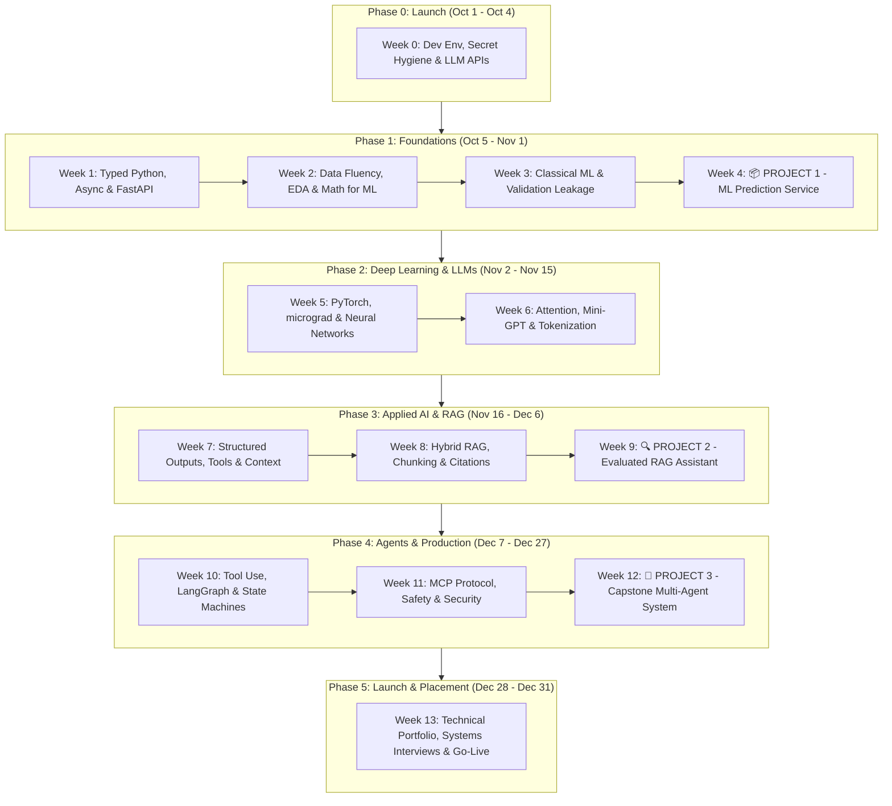

# 🚀 Job-Ready AI Engineer & Agentic Systems Journey
### 90-Day Intensive Plan · Oct 1 – Dec 31, 2026 · Hands-On & Production-Oriented

[](https://www.python.org/)
[](https://fastapi.tiangolo.com/)
[](https://pytorch.org/)
[](https://langchain-ai.github.io/langgraph/)
[](https://ai.pydantic.dev/)
[](https://modelcontextprotocol.io/)
[](LICENSE)

---

## 📌 Executive Summary & Mission

This repository documents an intensive, **90-day learning and building roadmap (October 1 – December 31, 2026)** designed to master the transition from software engineering into applied **AI & Agentic Systems Engineering**.

Modern AI Engineering is not about toy prompt scripts or endless notebook tutorials. It sits at the intersection of **clean software craft**, **robust data fluency**, **retrieval architectures (RAG)**, and **stateful, autonomous agentic loops (MCP & tool-calling)**, backed by rigorous **evaluations** and **production deployment**.

### The Dec 31, 2026 Target
By the end of this 90-day cycle, this repository delivers:
1. **Three Production-Grade Deployed Systems**:
   - 📦 **Project 1 (Week 4)**: End-to-End Classical ML Service (FastAPI, MLflow, Dockerized, Typed & Tested).
   - 🔍 **Project 2 (Week 9)**: Production RAG Assistant with Hybrid Search, Reranking, Citations, & Comprehensive Eval Harness (Golden Set + Langfuse Tracing).
   - 🤖 **Project 3 (Week 12)**: Autonomous Multi-Agent Capstone built on **Model Context Protocol (MCP)**, Memory, Guardrails, & CI/CD.
2. **Deep Foundational Competence**: PyTorch backprop from scratch, micrograd, tokenization, self-attention, and fine-tuning mechanics.
3. **Evidence-Driven Engineering**: Every system is evaluated quantitatively. If it cannot be measured, it cannot be trusted in production.

---

## 🏗️ Core Architecture & Roadmap Overview



---

## 🛠️ The Technology Stack

| Layer | Tools & Frameworks | Purpose |
| :--- | :--- | :--- |
| **Language & Tooling** | Python 3.12+, `uv`, `venv`, `ruff`, `mypy` | Strict typing, fast dependency management, high code standards |
| **Backend & APIs** | FastAPI, Pydantic v2, HTTPX, AsyncIO | High-concurrency async endpoints, robust validation |
| **Classical ML & Math** | NumPy, Pandas, Scikit-learn, MLflow | Data pipelines, EDA, model tracking, leak-free CV |
| **Deep Learning** | PyTorch, Hugging Face Transformers | Custom training loops, embeddings, fine-tuning |
| **Retrieval (RAG)** | Qdrant / Chroma, BM25 + Vector Hybrid, Cross-Encoders | Context injection, semantic chunking, grounded citations |
| **Agentic Frameworks** | LangGraph, PydanticAI, MCP (Model Context Protocol) | State machines, structured tool calling, dynamic workflows |
| **Evals & Observability**| Langfuse, Phoenix, Ragas, Golden Test Sets | Precision/Recall, Faithfulness metrics, tracing latencies/cost |
| **DevOps & Serving** | Docker, GitHub Actions, Render / Cloud Run | Containerization, CI/CD automated pipelines, cloud hosting |

---

## 🏆 The 3 Portfolio Flagships

### 1. Project 1: Production Machine Learning Service (Week 4)
* **Goal**: Build and serve a clean, tested predictive ML microservice on a real-world tabular dataset.
* **Key Components**:
  - Exploratory Data Analysis (EDA) and automated data-cleaning pipeline.
  - Leak-free feature transforms and model selection tracked via **MLflow**.
  - **FastAPI** inference service exposing `/predict` and `/health` with Pydantic schema validation.
  - Comprehensive unit and integration test suite (`pytest`) mocking upstream dependencies.
  - Standardized **Model Card** documenting evaluation metrics, limitations, and intended operating domain.

### 2. Project 2: Evaluated Production RAG Assistant (Week 9)
* **Goal**: Enterprise-grade retrieval pipeline over technical documentation, featuring rigorous quantitative evaluation.
* **Key Components**:
  - Hybrid search engine combining **Dense Embeddings** + **Sparse Lexical Search (BM25)** with **Cross-Encoder Reranking**.
  - Grounded answer generation enforcing source citations with character-offset verification.
  - 50-item curated **Golden Evaluation Set** measuring Retrieval Recall@K, Answer Faithfulness, and Context Relevance.
  - Production observability with **Langfuse / Phoenix** tracking token costs, latency spikes, and query drift.
  - Interactive Web UI and live deployment.

### 3. Project 3: Autonomous Agentic Capstone with MCP (Week 12)
* **Goal**: Full-lifecycle autonomous agent architecture featuring tools, external memory, and custom protocol integrations.
* **Key Components**:
  - State machine workflow implemented via **LangGraph** & **PydanticAI**.
  - Custom **Model Context Protocol (MCP)** server providing secure tool-execution boundaries.
  - Stateful session memory with conversational checkpointing and dynamic context pruning.
  - Security hardening against prompt injection, jailbreaks, and unauthorized tool invocation.
  - Fully Dockerized deployment with automated GitHub Actions CI pipeline and demonstration video.

---

## 📅 14-Week Detailed Syllabus & Progress

| Wk | Dates | Theme & Focus Area | Deliverable & Output | Status |
|:---:|:---:|:---|:---|:---:|
| **0** | Oct 1 – Oct 4 | **Launch: Setup, Secrets & Python Warm-up**<br>Toolchain setup (`uv`/`venv`), API secrets hygiene, local Ollama execution, baseline self-assessment. | Public Repo, `hello_llm.py`, `.env.example`, Baseline Scores | ✅ Done |
| **1** | Oct 5 – Oct 11 | **Python & Software Engineering for AI**<br>Dataclasses, async I/O (`asyncio`, `httpx`), Pydantic v2 validation, `pytest` fixtures, FastAPI routes. | FastAPI microservice with test suite & async batch caller | 🔄 In Progress |
| **2** | Oct 12 – Oct 18 | **Data Skills & Math for Machine Learning**<br>Vector math, matrix calculus, NumPy, Pandas transformations, gradient descent from mathematical first principles. | Full EDA notebook + gradient descent engine from scratch | ⏳ Pending |
| **3** | Oct 19 – Oct 25 | **Machine Learning I: Supervised Learning**<br>Classification, regression, leakage prevention, stratified K-Fold CV, precision/recall trade-offs, XGBoost/LightGBM. | 2 competitive Kaggle submissions + ML metrics reference | ⏳ Pending |
| **4** | Oct 26 – Nov 1 | **Machine Learning II & PROJECT 1**<br>End-to-end ML training pipeline, artifact serialisation, MLflow experiment tracking, containerization, FastAPI serving. | 📦 **PROJECT 1: Deployed ML Service & Model Card** | ⏳ Pending |
| **5** | Nov 2 – Nov 8 | **Deep Learning with PyTorch**<br>Autograd mechanics, tensors, training loops, activation functions, regularization, CNN architectures on CIFAR-10. | Autograd engine (`micrograd` reproduction) + CIFAR-10 CNN | ⏳ Pending |
| **6** | Nov 9 – Nov 15 | **Transformers & LLMs Under the Hood**<br>Tokenization (BPE), scaled dot-product attention, multi-head attention, decoder architectures, positional encodings. | Trainable mini-GPT on Shakespeare + Technical Deep-Dive Post | ⏳ Pending |
| **7** | Nov 16 – Nov 22 | **LLM APIs, Structured Outputs & Context Engineering**<br>JSON schema enforcement, Pydantic function calling, streaming responses, exponential backoff retries, prompt testing. | `llm-toolkit` Python library + 3 utility micro-apps | ⏳ Pending |
| **8** | Nov 23 – Nov 29 | **RAG I: Hybrid Retrieval & Grounded Generation**<br>Chunking strategies, dense/sparse embeddings, vector indexing, reciprocal rank fusion (RRF), citation grounding. | Baseline RAG pipeline with citations + 30-item Golden Eval Set | ⏳ Pending |
| **9** | Nov 30 – Dec 6 | **RAG II: Evaluation, Observability & PROJECT 2**<br>RAG Triad metrics (Faithfulness, Answer Relevance, Context Recall), LLM-as-a-judge, Langfuse telemetry, latency optimization. | 🔍 **PROJECT 2: Live Evaluated RAG Assistant + Evaluation Report** | ⏳ Pending |
| **10** | Dec 7 – Dec 13 | **Agents I: Tool Use, Planning & LangGraph**<br>ReAct pattern, cyclical execution graphs, state machines, human-in-the-loop approvals, sub-agent delegation. | Scratch ReAct loop + Production LangGraph multi-step agent | ⏳ Pending |
| **11** | Dec 14 – Dec 20 | **Agents II: Model Context Protocol (MCP) & Safety**<br>MCP Client/Server spec, sandboxed tool execution, prompt injection defense, red-teaming, PII masking. | Custom MCP Server + Security test suite + Capstone MVP | ⏳ Pending |
| **12** | Dec 21 – Dec 27 | **Production: LLMOps, Fine-Tuning & PROJECT 3**<br>Docker Compose deployment, LoRA / PEFT fine-tuning fundamentals, GitHub Actions CI/CD, rate-limiting & auth. | 🤖 **PROJECT 3: Deployed Agentic Capstone + CI + Demo Video** | ⏳ Pending |
| **13** | Dec 28 – Dec 31 | **Final Sprint: Portfolio, System Design & Placement**<br>System design for LLM applications, live portfolio compilation, technical interview rehearsal, applications launch. | Complete Technical Portfolio, Resume, 10 Targeted Apps | ⏳ Pending |

---

## ⚡ The 7 Operating Rules

1. **Build Over Consume (70/30 Rule)**: Watching a video without writing code yields zero retention. If you finish a tutorial without writing tests and running experiments, you have not finished it.
2. **Ship Every Saturday**: Code on your machine does not exist to the world. Every week ends with pushed code, passing tests, and updated documentation.
3. **Commit to One Stable Stack**: Resist framework churn. We anchor on Python, FastAPI, PyTorch, LangGraph/PydanticAI, and Docker.
4. **Measure Everything**: Anecdotal prompt quality is a trap. Start evals in Week 7 with golden sets, LLM judges, and regression suites.
5. **The 30-Minute Unblocking Protocol**: If stuck for 30 minutes, inspect stack traces, isolate the minimal reproducible example, search issues, consult documentation, and document the solution in `/notes`.
6. **Learn in Public**: Document trade-offs, architecture decisions, and post-mortems directly in the repository and technical articles.
7. **Protect Stamina & Recovery**: Sustained 30 hours/week requires deliberate breaks, physical exercise, and strict sleep schedules.

---

## ⏱️ Weekly Study Rhythm (~30 Hours/Week)

```
┌────────────────────────────────────────────────────────────────────────┐
│  WEEKLY TIME ALLOCATION                                                │
├────────────────────────────────────────────────────────────────────────┤
│  Mon – Fri  │ ≈ 4.0 hrs/day │ 2.0h Core Concepts & Architecture        │
│             │               │ 1.5h Hands-on Implementation & Tests     │
│             │               │ 0.5h DSA & Core CS Revision              │
├─────────────┼───────────────┼──────────────────────────────────────────┤
│  Saturday   │ 5.0 – 6.0 hrs │ Project Ship Day: Build Deliverable,     │
│             │               │ Write Integration Tests, Push to GitHub  │
├─────────────┼───────────────┼──────────────────────────────────────────┤
│  Sunday     │ ≈ 3.0 hrs     │ 20m Retro, Update README & Notes,        │
│             │               │ 4 DSA Problems, Plan Next Week Outcomes  │
└────────────────────────────────────────────────────────────────────────┘
```

---

## 📂 Repository Directory Layout

```text
├── .env.example              # Template environment variables (no raw secrets!)
├── .gitignore                # Python, virtualenv, and secret exclusions
├── README.md                 # Primary roadmap and project hub
├── daily-log.md              # Daily progress, blockers, and time tracking
├── ai-engineer-guide.pdf     # Complete 90-day curriculum master guide
├── notes/                    # Technical deep dives, cheatsheets & architecture notes
│   ├── week-01-python.md
│   └── ...
├── projects/                 # Flagship Portfolio Projects
│   ├── project-1-ml-service/ # Week 4: End-to-end ML prediction microservice
│   ├── project-2-rag-eval/   # Week 9: Production RAG assistant with evals
│   └── project-3-agent-mcp/  # Week 12: Autonomous agent capstone on MCP
└── week-01/                  # Weekly hands-on lab code & deliverables
    ├── coder-agent1.py       # PydanticAI agent harness implementation
    └── ...
```

---

## 📊 Self-Assessment & Skill Benchmark

| Competency Area | Baseline (Week 0) | Midpoint (Week 6) | Target (Week 13) |
| :--- | :---: | :---: | :---: |
| **Python & Software Engineering** (typing, async, FastAPI, pytest) | `2 / 5` | `—` | **`4+ / 5`** |
| **Data Engineering & SQL** (Pandas, vectorization, CTEs, joins) | `2 / 5` | `—` | **`3+ / 5`** |
| **Classical Machine Learning** (CV, metrics, leakage prevention, ensembles) | `1 / 5` | `—` | **`3+ / 5`** |
| **Deep Learning with PyTorch** (custom training loop, backprop, autograd) | `1 / 5` | `—` | **`3+ / 5`** |
| **Transformers & LLM Internals** (attention, BPE, sampling, KV caching) | `1 / 5` | `—` | **`3+ / 5`** |
| **LLM APIs & Prompt Engineering** (structured output, tool calling, retries) | `2 / 5` | `—` | **`4+ / 5`** |
| **RAG Architectures** (hybrid search, chunking, reranking, citations) | `1 / 5` | `—` | **`4+ / 5`** |
| **Evaluation & Observability** (golden datasets, Ragas, Langfuse tracing) | `1 / 5` | `—` | **`4+ / 5`** |
| **Agentic Loops & MCP** (LangGraph, autonomous tools, MCP server spec) | `1 / 5` | `—` | **`3+ / 5`** |
| **Deployment & LLMOps** (Docker, CI/CD, rate limiting, fallbacks) | `1 / 5` | `—` | **`3+ / 5`** |
| **Security & Safety** (prompt injection testing, least-privilege tools) | `1 / 5` | `—` | **`3+ / 5`** |

*Scoring Standard*:
- `1` = Conceptual awareness only; cannot implement without guidance.
- `2` = Followed tutorials; cannot reproduce autonomously.
- `3` = **Job-Ready Baseline**: Built independently from scratch; can defend trade-offs.
- `4` = Production-ready standard with automated tests, evals, and documentation.
- `5` = Mastery: Capable of leading architecture, code review, and mentoring.

---

## 🚀 Quickstart & Setup Guide

### 1. Clone & Set Up Python Environment
```bash
git clone https://github.com/adnanaskh/agentic-ai-journey.git
cd agentic-ai-journey

# Using uv (recommended)
uv venv
source .venv/bin/activate  # On Windows: .venv\Scripts\activate

# Or standard Python venv
python -m venv venv
venv\Scripts\activate
```

### 2. Configure Environment Variables
Copy the template configuration and supply your API keys:
```bash
cp .env.example .env
```
Ensure your `.env` contains:
```ini
GEMINI_API_KEY=your_gemini_key_here
GROQ_API_KEY=your_groq_key_here
# Optional:
LANGFUSE_PUBLIC_KEY=your_public_key
LANGFUSE_SECRET_KEY=your_secret_key
LANGFUSE_HOST=https://cloud.langfuse.com
```

### 3. Verify Local Agent Execution
Test the Week 1 PydanticAI agent harness:
```bash
python week-1/coder-agent1.py
```

---

## 📈 Learning Log & Accountability
All daily notes, commit streaks, and retro milestones are tracked in [`daily-log.md`](file:///d:/ai-engineer/daily-log.md).

> *"We don't rise to the level of our expectations; we fall to the level of our training and disciplined execution."*
